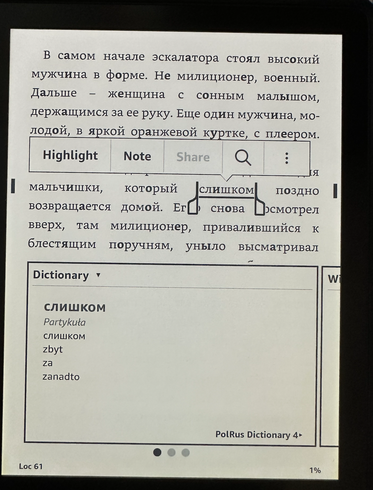

# Prosty skrypt dodający akcenty w rosyjskich słowach do książek w formacie EPUB

## Jak to działa?

Uruchom program, podając ścieżkę do pliku EPUB jako parametr. W tym samym katalogu zostanie utworzony nowy plik o nazwie kończącej się na `-with-accent.epub`.

Przykład książki z dodanymi akcentami:  

## Jak używać książek z akcentami na Kindle?

1. Najpierw dodaj akcenty do pliku `.epub` za pomocą programu.
2. Następnie użyj darmowego programu [Calibre](https://calibre-ebook.com/), aby przekonwertować plik `.epub` na `.azw` (format `.mobi` nie obsługuje pogrubiania pojedynczych liter).
3. Wgraj plik `.azw` na Kindle i ciesz się książką z akcentami!  
   

## Obecne ograniczenia programu

- Program korzysta z darmowego i otwartego słownika [openrussian.org](https://openrussian.org), który jest tworzony przez wolontariuszy. Może się zdarzyć, że pewnych słów w nim brakuje lub że akcenty zostały dodane niepoprawnie. Korzystasz na własną odpowiedzialność.

- Do działania programu wymagane jest zainstalowanie JDK 21.

## Podobne programy

- https://github.com/Vuizur/add-stress-to-epub
- https://github.com/FreeLanguageTools/stress-russian-books