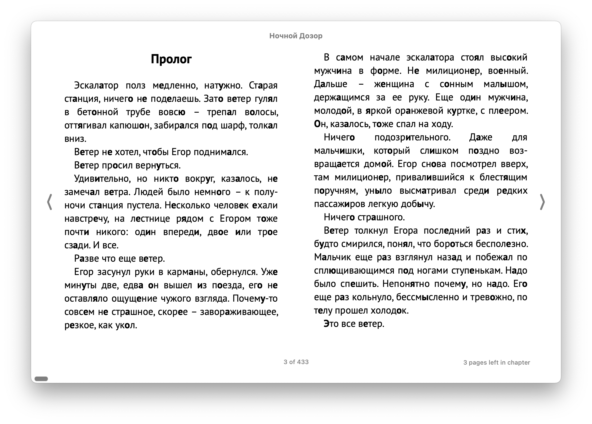

# Prosty skrypt który dodaje akcent w rosyjskich słowach do ksiażek w formacie EPUB

Jak do działa? Uruchom program ze ścieżką do pliku EPUB jako parameterem.
W tym samym katalogu zostanie utworzyony nowy plik z nazwą kończącą się na `-with-accent.epub`.

Przykładowa ksiażka z dodanym akcentem:

Obecne ograniczenia programu:

- Program bazuje na darmowym i otwartym słowniku [openrussian.org](https://openrussian.org),
 jest to słownik tworzony przez wolontariuszy. Pewnych słów może w nim brakować, w innych akcent może być
 niepoprawnie dodany. Korzystasz na własną odpowiedzialność.
- Dodanie akcentu sprawia że słowniki rosyjsko polskie mogą _nie działać_ poprawnie. 
 Planuję stworzyć specjalny słownik wyrazów z akcentem dla Kindla, ale zajmie mi to pewnie jeszcze trochę czasu.
 Jeżeli ktos potrzebuję i akcentu i działającego słownika to skrypt można łatwo przerobić tak żeby
 literka z akcentem była pogrubiana.
- Program do działania wymaga JDK 21.